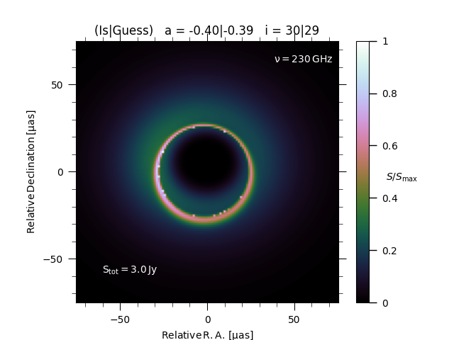
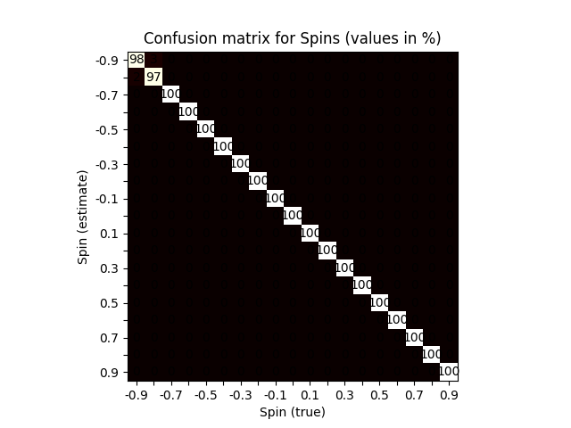
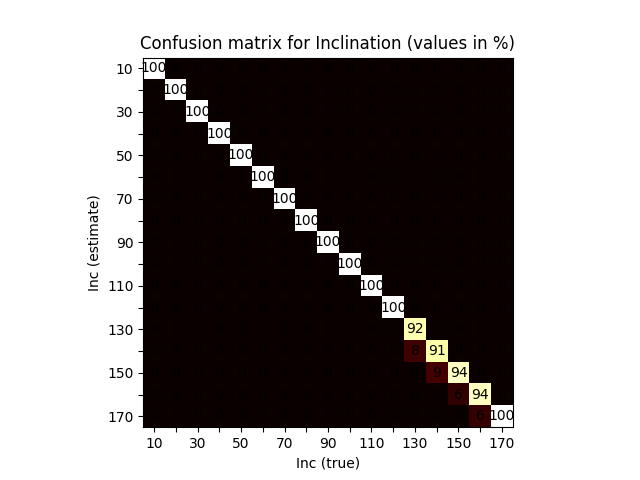

# Black Hole Parameter Inference from Simulated Images

This repository contains a small PyTorch-based research project for predicting
physical black hole parameters from simulated emission images.

The project was developed as final project for the 'computational astrophysics' lecture in 2021/2022.
The final report can be seen in `manuscript.pdf`

## Goal

The models are trained to infer:

- **spin** \(a\)
- **inclination** \(i\)

from simulated black hole images generated from GRRT / GRMHD-based simulations.

## Project Scope

This repository is **research code** created in the context of a student project.
It is intended to document the methodology and provide a reproducible baseline.

## Method

The workflow is:

1. Load simulated black hole images from `.npz` files (Due to the size those data can not be uploaded into Github)
2. Extract target parameters from the file names
3. Train separate neural networks for
   - spin regression
   - inclination regression
4. Evaluate performance using
   - mean absolute / squared error
   - confusion matrices
   - parameter-dependent error analysis

## Model Design

Two separate fully connected neural networks are used.

### Spin network
- input: flattened `128 x 128` image
- output: scalar spin parameter
- final activation: `Tanh`
- loss: `L1Loss`

### Inclination network
- input: flattened `128 x 128` image
- output: scalar inclination angle
- activations: `LeakyReLU`
- loss: `MSELoss`

## Results

Confusion matrices for spin and inclination predictions

.png)
.png)

Parameter-dependent prediction error.

The models achieve:

- **Spin prediction error:** ~10⁻²
- **Inclination prediction error:** a few degrees

In both cases the prediction error remains below the parameter grid
resolution of the simulation dataset.